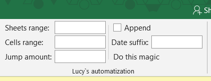
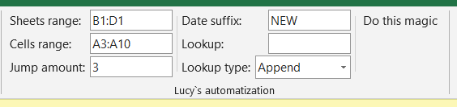
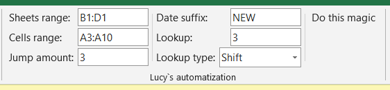
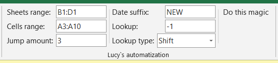
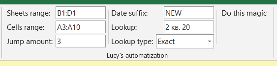
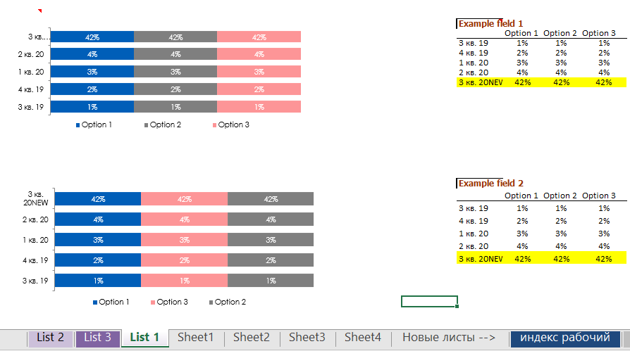
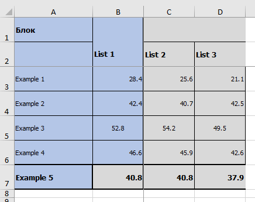
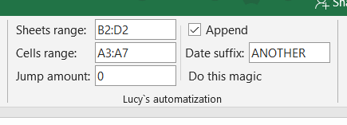
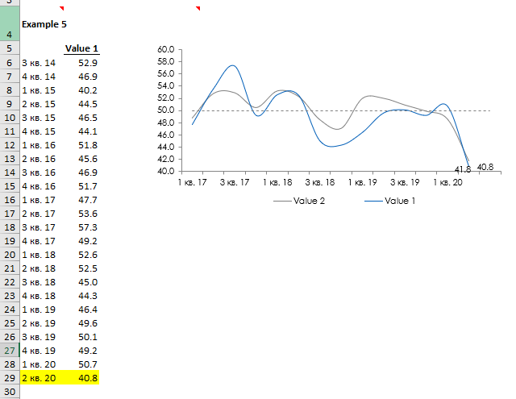

# Lucy automatization Excel AddIn
Small excel addin for automatization for statistics and charts

How it looks:

How to use:

In case if you have for example such table:

You fullfill the addin with following data:

Sheets range - on current page addin will look throught this range and find each sheet in this document from this range.

Cells range - on found sheets it will look for text that equals to the data from this range in current page.

Jump amount - text from previous field may go with gaps due to target values (in the example above it is options), this number is amount of them

Lookup type - possible variants of lookup: Append, Shift, Exact.

Lookup - accepts string to lookup, ignored if Append type choosen. Accepts number if Shift choosen. Accepts any string if Exact choosen.

Date suffix - on Y axis replaced or added values will have this suffix

Append type means that in col of values the solution will find the last one, then create new row and write values there.

Shift type means that in col of values the solution will shift <Lookup> amount of rows and set the values there. Note if you want to shift from top you gave to put positive values. If you want to shift from bottom negative ones. For example to find the last value you must put -1 to lookup. To find first put 1. If you will put 0 it will be the same as Append.

Exact type means that in col of values the solution will search for cell that contains text that was written in lookup. If such cell was not found warning will be triggered.

The result of the work:

In yellow you see new data and charts are moved the series.

Another example:

Here we do not have target values after cell

Result

